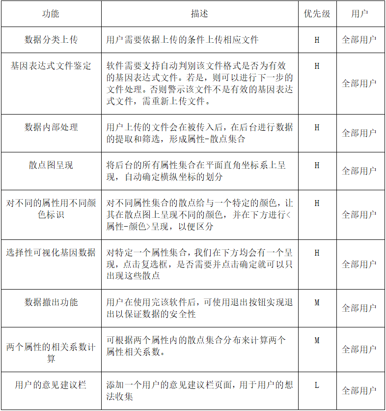

二、项目总体概述
========
2.1软件概述
-------
本项目具体能进行数据的导入，提取出某一激素（或其他量）在某一条件下对应的横纵坐标的位置，将大量的数据点在直角坐标系平面上进行散点呈现，同时可以大致得到一个近似的横纵坐标量的相关系数。同时，可以手动对目标的几个激素进行选择查看，查看其是否具有相关性。

2.2软件功能
----------

2.3用户特征
----------
本软件的使用人员有以下几类：

  1）有数值分析需求的科研工作者，如生物学家等

  2）其他对基因表达式数据处理感兴趣的人

由上述本软件的使用人员可知，该用户群体普遍接受过高等教育，学习及适应能力强，具有科学逻辑思维或是一定的编程能力。能快速适应该软件的数据上传要求甚至能对该软件的升级进行，并充分感受到在数据分析时的便利，提出合理的改进意见。
