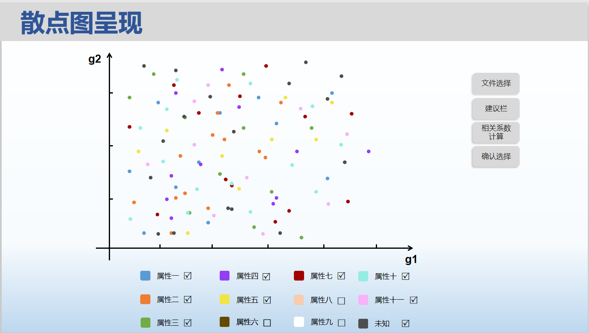

四、使用实例
===============
**用户实现基因数据转换成散点图**
 - **角色：** 用户
 - **目的：** 一个需要分析基因数据的用户，希望通过上传基因数据文件，来快速得到对应的散点图。
 - **主要情景：** 
  - **1.文件选择**  在打开页面之后，我们会先呈现一个用户选择数据的页面，在选择前，会有一个提示消息告知用户如何进行文件选择以及文件的要求信息。在成功选择了三个文件后点击提交，就可以进行后台的数据处理，转到下面的散点图。
  - **2.散点图呈现**  在成功提交文件之后，经过后台数据集合的处理后，会整理出各个数据集合点，每个集合都会有一个对应的颜色呈现在下方，每个集合里的点都会按照自己的坐标呈现在上方的基因的直角坐标系中，并有自己对应的颜色，图中会默认呈现出所有的点。
  - **3.基因数据筛选**  对特定一个属性，单击该属性前的颜色之后可实现对应点集的隐藏和显示。
  - **4.相关性系数计算**  由于相关系数的计算关系到的是对某一组织g1,g2之间的相关性，故在下方会呈现出所有属性的相关性系数，并可根据系数大小排序。
  

